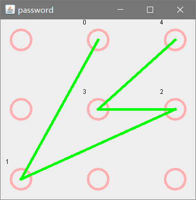

# gesture
android4.2以下root过的设备九宫格密码破解
***

# 原理
android4.2以下root完全的设备，在锁屏的状态下也可以usb调试，这个时候只需要把/data/system/gesture.key文件用adb导出来。再对这段数据暴力破解，就可以查看密码。
# 用法
* 方法1.运行Test这个类，就会自动计算出密码并且显示出来
* 方法2.直接运行已经打包好的jar文件，文件在bin目录下。运行方法 java -jar gesture.jar

# 注意
1. 手机系统版本必须是4.2以下
2. 必须root完全。你可以进入adb shell，然后执行 `cat /data/system/gesture.key` 看看是否会有一些乱码输出，如果有就说明已经root完全了，如果处理permission denied就说明root不完全
3. 第二次运行的时候需要把gesture.key删除
4. 需要有Android adb工具，并且在环境变量PATH中添加adb的路径
